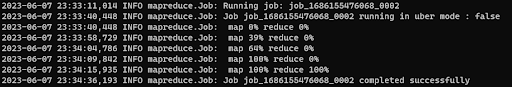

# <p style="text-align: center;">Hadoop</p>

<p align="center">
  
</p>

Hadoop provides a comprehensive framework for developing applications that can perform statistical analysis on vast amounts of data. By dividing the data into smaller chunks and processing them in parallel across a cluster of computers, Hadoop offers scalability and efficiency for big data analysis.

Hadoop consists of two primary components:

- Hadoop Distributed File System (HDFS): HDFS is a distributed file system designed to store large volumes of data across multiple machines in a Hadoop cluster. It ensures high fault tolerance and leverages data locality, processing data on the same machine where it resides.

- MapReduce: MapReduce is a programming model and computational algorithm used for distributed processing of data in a Hadoop cluster. It partitions the input data into smaller subsets, processes them in parallel, and combines the results to produce the final output.

## **Hadoop Map Reduce**

Hadoop MapReduce is a software framework used for processing large data sets in a distributed computing environment. It is a component of the Apache Hadoop project, an open-source tool designed to handle Big Data by breaking it down into smaller, manageable parts. MapReduce works on the principle of "divide and conquer" where data is divided into individual chunks to be processed.

The framework comprises two main functions: the Map function and the Reduce function. The Map function takes input data, splits it into smaller sub-parts, and applies a mapping function to each, which converts the input into a set of intermediate key-value pairs. These intermediate pairs are then sorted and passed to the Reduce function. The Reduce function takes these pairs as input and combines the values that share the same key, generating a smaller set of output values. The combination of the Map and Reduce functions allows Hadoop to process and analyze vast amounts of data in a scalable, distributed manner.

## **Group Members**

|         Name          |    NPM     |
| :-------------------: | :--------: |
|  Abdul Fikih Kurnia   | 2106731200 |
|  Bintang Marsyuma R   | 2106731415 |
|     Ibrahim Rijal     | 2106633323 |
| Stefan Agusto Hutapea | 2106700744 |

## **Hadoop Installation**

## Setup Hadoop on Windows 10

The following instructions provide a comprehensive guide for setting up and running Hadoop on Windows 10 machines. These instructions are derived from the step-by-step guide titled "Hadoop 3.2.1 Installation on Windows 10" available at this [link](https://kontext.tech/column/hadoop/377/latest-hadoop-321-installation-on-windows-10-step-by-step-guide).

## Required tools

1. Java JDK - required to execute Hadoop as it is developed using Java programming language.
2. WinRAR - utilized to extract the Hadoop binary package, which is typically in tar.gz format. Any software capable of extracting such compressed files can be used.
3. CMD - employed to test environment variables and execute Hadoop commands on the command line interface.

## Step 1 - Download and extract Hadoop

Obtain the Hadoop software by downloading it from the official website and extracting the downloaded file. In this guide, we will be using Hadoop [3.2.1](https://www.apache.org/dyn/closer.cgi/hadoop/common/hadoop-3.2.1/hadoop-3.2.1.tar.gz). Since Hadoop is portable, you have the flexibility to store it on an external hard drive if desired. For the sake of this documentation, let's assume that the extraction location is set to

```
C:/Users/abdfikih/Documents/hadoop
```

In case you encounter permission errors during the extraction process, it is recommended to run your unzipping program as an administrator and then attempt the extraction again

## Step 2 - Install Hadoop native IO binary

To proceed, either clone or download the [winutils](https://github.com/cdarlint/winutils) repository. Afterward, copy the contents of the hadoop-3.2.1/bin directory from the winutils repository and paste them into the corresponding directory within the extracted location of the Hadoop binary package. In the provided example, the target directory would be :

```
C:\Users\abdfikih\Documents\hadoop\hadoop-3.2.1\bin
```

## Step 3 - Install Java JDK

In order to run Hadoop, it is necessary to have Java JDK installed. If you don't already have it installed, please proceed with the installation.

Please note that Oracle requires users to sign up and log in to download Java JDK. As an alternative, you can search for alternative sources to download the JDK, such as this example resource [(JDK 8u261)](https://enos.itcollege.ee/~jpoial/allalaadimised/jdk8/).

However, please keep in mind that the availability of this resource may not be permanent. Therefore, it is recommended to search for the specific JDK version you need using a search engine.

Once you have obtained the installation file, run it and follow the installation process. The default installation directory will typically be set to :

```
C:\Program Files\Java\jdk1.8.0_261
```

Once the installation is complete, open the Command Prompt (CMD) or PowerShell to verify the successful installation of Java by following these steps:

```
$ java -version
java version "1.8.0_261"
Java(TM) SE Runtime Environment (build 1.8.0_261-b12)
Java HotSpot(TM) 64-Bit Server VM (build 25.261-b12, mixed mode)
```

## Step 4 - Configure environment variables

To access the `System Properties` window, you can follow these steps:

1. Open the Start Menu on your computer.
2. Type `environment` in the search bar.
3. Press Enter to execute the search.
4. A new window, labeled `System Properties,` should open up.
5. Within the System Properties window, locate and click the `Environment Variables` button located near the bottom right corner.

### `JAVA_HOME` environment variable

1. In the step mentioned earlier (step 3), locate the installation directory of Java on your system. For instance, in this example, the default directory is `C:\Program Files\Java\jdk1.8.0_261`.
2. Proceed to create a new **User variable** with the variable name JAVA_HOME and the corresponding value `C:\Program Files\Java\jdk1.8.0_261`.

### `HADOOP_HOME` environment variable

1. Referring back to step 1, copy the directory path where you extracted the Hadoop binaries to. In this specific example, the directory path is `C:\Users\abdfikih\Documents\hadoop\hadoop-3.2.1`.
2. Proceed to create a new User variable named HADOOP_HOME with the corresponding value `C:\Users\abdfikih\Documents\hadoop\hadoop-3.2.1`.

### `PATH` environment variable

We'll now need to add the bin folders to the `PATH` environment variable.

1. Click `Path` then `Edit`
2. Click `New` on the top right
3. Add `C:\Users\abdfikih\Documents\hadoop\hadoop-3.2.1\bin`
4. Add `C:\Program Files\Java\jdk1.8.0_261\bin`

### Hadoop environment

If the `JAVA_HOME` directory contains spaces, Hadoop may encounter issues. In the default installation directory, such as Program Files, which includes a space, this can be problematic. To resolve this, open the file `%HADOOP_HOME%\etc\hadoop\hadoop-env.cmd` and modify the `JAVA_HOME` line to the following:

```
set JAVA_HOME=C:\PROGRA~1\Java\jdk1.8.0_261
```

Once you have set up the environment variables as described, reopen the Command Prompt (CMD) or PowerShell and verify the availability of the `hadoop` command by following these steps:

```
$ hadoop -version
java version "1.8.0_261"
Java(TM) SE Runtime Environment (build 1.8.0_261-b12)
Java HotSpot(TM) 64-Bit Server VM (build 25.261-b12, mixed mode)
```

## Step 5 - Configure Hadoop

We are now prepared to configure the `crucial` components of Hadoop, which include Core, YARN, MapReduce, and HDFS configurations.

These configuration files can be found in the %HADOOP_HOME%\etc\hadoop directory. In the context of this example, the complete path for these configuration files is

```
C:\Users\abdfikih\Documents\hadoop\hadoop-3.2.1\etc\hadoop
```

### Configure core site

Edit `core-site.xml` and replace the `configuration` element with the following:

```
<configuration>
  <property>
    <name>fs.default.name</name>
    <value>hdfs://0.0.0.0:19000</value>
  </property>
</configuration>
```

### Configure HDFS

Create two folders, one for the namenode directory and another for the data directory. The following are the two created folders in this example:

1. `C:\Users\abdfikih\Documents\hadoop\hadoop-3.2.1\data\dfs\namespace_logs`
2. `C:\Users\abdfikih\Documents\hadoop\hadoop-3.2.1\data\dfs\data`

Edit `hdfs-site.xml` and replace the `configuration` element with the following:

```
<configuration>
  <property>
    <name>dfs.replication</name>
    <value>1</value>
  </property>
  <property>
    <name>dfs.namenode.name.dir</name>
    <!-- <value>file:///DIRECTORY 1 HERE</value> -->
    <value>file:///C:/Users/abdfikih/Documents/hadoop/hadoop-3.2.1/data/dfs/namespace_logs</value>
  </property>
  <property>
    <name>dfs.datanode.data.dir</name>
    <!-- <value>file:///DIRECTORY 2 HERE</value> -->
    <value>file:///C:/Users/abdfikih/Documents/hadoop/hadoop-3.2.1/data/dfs/data</value>
  </property>
</configuration>
```

### Configure MapReduce and YARN site

Edit `mapred-site.xml` and replace the `configuration` element with the following:

```
<configuration>
  <property>
    <name>mapreduce.framework.name</name>
    <value>yarn</value>
  </property>
  <property>
    <name>mapreduce.application.classpath</name>
    <value>%HADOOP_HOME%/share/hadoop/mapreduce/*,%HADOOP_HOME%/share/hadoop/mapreduce/lib/*,%HADOOP_HOME%/share/hadoop/common/*,%HADOOP_HOME%/share/hadoop/common/lib/*,%HADOOP_HOME%/share/hadoop/yarn/*,%HADOOP_HOME%/share/hadoop/yarn/lib/*,%HADOOP_HOME%/share/hadoop/hdfs/*,%HADOOP_HOME%/share/hadoop/hdfs/lib/*</value>
  </property>
</configuration>
```

Edit `yarn-site.xml` and replace the `configuration` element with the following:

```
<configuration>
  <property>
    <name>yarn.resourcemanager.hostname</name>
    <value>localhost</value>
  </property>
  <property>
    <name>yarn.nodemanager.aux-services</name>
    <value>mapreduce_shuffle</value>
  </property>
  <property>
    <name>yarn.nodemanager.env-whitelist</name>
    <value>JAVA_HOME,HADOOP_COMMON_HOME,HADOOP_HDFS_HOME,HADOOP_CONF_DIR,CLASSPATH_PREPEND_DISTCACHE,HADOOP_YARN_HOME,HADOOP_MAPRED_HOME</value>
  </property>
</configuration>
```

## Step 6 - Initialize HDFS and bugfix

When executing the command below, you may encounter the following error:

```
hdfs namenode -format
...
ERROR namenode.NameNode: Failed to start namenode.
...
```

To resolve this issue, you will need to download a JAR file that contains the necessary fix. You can obtain the JAR file from this [link](https://github.com/FahaoTang/big-data/blob/master/hadoop-hdfs-3.2.1.jar). Once downloaded, replace the existing `hadoop-hdfs-3.2.1.jar` file in the `%HADOOP_HOME%\share\hadoop\hdfs` directory with the newly downloaded JAR file. It is advisable to create a backup of the current JAR file before overwriting it, if desired.

## Step 7 - Start HDFS daemons

Execute the following command to initiate the HDFS daemons. Upon running this command, two new windows should appear: one for the datanode and another for the namenode.

```
%HADOOP_HOME%\sbin\start-dfs.cmd
```

## Step 8 - Start YARN daemons

To initiate the YARN daemons, execute the following command (with elevated permissions). Upon running this command, two new windows should open: one for the resource manager and another for the node manager.

```
%HADOOP_HOME%\sbin\start-yarn.cmd
```

## Step 9 - Useful Web portals

The daemons also host websites that provide useful information about the cluster

### HDFS Namenode UI info

[http://localhost:9870/dfshealth.html#tab-overview](http://localhost:9870/dfshealth.html#tab-overview)

### HDFS Datanode UI info

[http://localhost:9864/datanode.html](http://localhost:9864/datanode.html)

### YARN resource manager UI

[http://localhost:8088](http://localhost:8088)

## Step 10 - Shutdown YARN and HDFS daemons

And for stop this process, you can input command following this :

```
%HADOOP_HOME%\sbin\stop-dfs.cmd
%HADOOP_HOME%\sbin\stop-yarn.cmd
```

## **Running Hadoop and Word Count**

Open a command prompt as administrator and run the following command to create an input and output folder on the Hadoop file system, Like this :

```
hadoop fs -mkdir /input
hadoop fs -mkdir /output
```

Now let’s move the file “exmaple.txt”, from D: to /input :

```
hadoop fs -put D:/download/example.txt /input
```

We can verify the file has moved successfully on the following link:

```
hadoop fs -ls /input
```

For the next step, we’ll need the `“hadoop-mapreduce-examples-3.2.1.jar”`, found in `“D:\hadoop-env\hadoop-3.2.1\share\hadoop\mapreduce”`.

We’ll execute the following command in order to call the function wordcount inside the mapreduce Like this:

```
hadoop jar D:\hadoop-env\hadoop-3.2.1\share\hadoop\mapreduce\hadoop-mapreduce-examples-3.2.1.jar wordcount /input/example.txt /output
```

Following message will appear on the command prompt :



Now you can find the results of the wordcount on the output we created.

Open up the output_dir folder inside the Hadoop interface on the following link:

```
http://localhost:9870/explorer.html#/output
```

and click the file named `part-r-00000`(1), and a small window will show up, click the `download`(2) option, and there you will be able to see the number of appearances for each word in the example file.

## **Experiment performs Hadoop MapReduce**

The purpose of this experiment is to test the difference in execution time between the word count program (Java) using the Hadoop MapReduce framework and without the framework. This experiment aims to understand the extent to which Hadoop MapReduce can enhance the performance of distributed data processing.

### Background

In big data processing, such as Big Data analytics, an efficient approach is often required to process and analyze large datasets. Hadoop MapReduce is one of the popular frameworks used for distributed data processing. This framework allows us to divide data processing tasks into multiple steps that can be performed in parallel across multiple nodes in a cluster. Thus, Hadoop MapReduce can improve processing efficiency and reduce the execution time of complex processing tasks.

### Objective

The objective of this experiment is to compare the execution time of the word count program using Hadoop MapReduce and without using the framework. By conducting this experiment, we can measure the effectiveness of Hadoop MapReduce in processing and analyzing data on a large scale.

### Hardware Specifications

|  Part   |                          Specifications                          |
| :-----: | :--------------------------------------------------------------: |
|   CPU   | Intel Core i5-1135G7 dual-core (4 thread) 3GHz TurboBoost 4,1GHz |
|   RAM   |                         8GB DDR4 3200MHz                         |
| Storage |                    512GB PCIe 3.0 x4 M2 NVMe                     |

### Dataset Source

The dataset used in this experiment was obtained from source website. It consists of a collection of text documents in various formats, such as plain text, PDF, and HTML. The dataset encompasses a wide range of topics and is representative of real-world data that requires processing and analysis.

- 1 MB : [Resources](https://drive.google.com/file/d/1K7Oln7oheItmJZ4sZO13KTeU90XmSN3E/view?usp=sharing)
- 10 MB : [Resources](https://drive.google.com/file/d/1Meb-WsPJzBgT8fQLQlAsskwag5bEOSGv/view?usp=sharing)
- 100 MB : [Resources](https://drive.google.com/file/d/12kQcD6sXR9Owf3Uk7Hr7vCdlqBR90vp-/view?usp=sharing)
- 200 MB : [Resources](https://drive.google.com/file/d/1krZVPxzodDvRqtH1xb3gFBPjhLO3LLND/view?usp=sharing)
- 500 MB : [Resources](https://drive.google.com/file/d/1hSr3CAFkSveR1--hIuKFE-FQ3pmswL1Z/view?usp=sharing)
- 1000 MB : [Resources](https://drive.google.com/file/d/1Z_T6Lb2K2e3JFxrXsnECwOhGHUN0TfVG/view?usp=sharing)

### Word Count Source Code

The following are the source codes for the word count program used:

#### [Word Count with Hadoop MapReduce](https://hadoop.apache.org/docs/r2.7.2/hadoop-mapreduce-client/hadoop-mapreduce-client-core/MapReduceTutorial.html#Example:_WordCount_v1.0)

#### [Word Count without Framework](/code/wordcount.java)

The source code for the word count program with Hadoop MapReduce can be found in the official Apache Hadoop documentation. It provides a detailed explanation and example code for implementing the word count algorithm using the Hadoop MapReduce framework.

The source code for the word count program without any framework is available in the file [CountDriver.java](/code/CountDriver.java). This implementation is a simplified version that demonstrates how to perform word count without relying on any specific framework.

### Experiment Results

Here are the results of the conducted experiment:

| Dataset | Word Count with Hadoop MapReduce | Word Count without Framework | Scalable |
| :-----: | :------------------------------: | :--------------------------: | :------: |
|  1 MB   |              17 sec              |          0,546 sec           |  31,13   |
|  10 MB  |              19 sec              |           1,39 sec           |  13,66   |
| 100 MB  |            55,33 sec             |          129,67 sec          |   0,42   |
| 200 MB  |            68,43 sec             |          203,85 sec          |   0,33   |
| 500 MB  |            109,72 sec            |          307,83 sec          |   0,32   |
| 1000 MB |            152,86 sec            |          521,08 sec          |   0,29   |

### Experiment Results Graph

Here is the graph representing the results of the conducted experiment:


## Analysis of Experiment Results

Based on the experiment results and the graph, A thorough analysis of the speed differences between Hadoop and the Java Word Count program can be explained as follows:

Hadoop is a framework for processing data designed to handle large volumes of data in a distributed manner. It uses the MapReduce approach, where data is divided into blocks, which are then processed in parallel by multiple nodes in a cluster. On the other hand, the Java Word Count program is a Java program that counts the number of words in a text without using any framework.


1. In general, Hadoop is slower in performing Word Count compared to the standalone Java Word Count program. This can be observed from the recorded execution times in the table. Several factors contribute to this difference:

- a. Framework Overhead: Hadoop has additional overhead to manage during processing. This includes the process of dividing data into blocks, task scheduling, data transmission between nodes, and result synchronization. These overheads cause Hadoop to require additional time to initiate and coordinate processing tasks.

- b. Data Partitioning and Parallel Processing: While data partitioning and parallel processing in Hadoop enhance its scalability, they also introduce additional overhead in terms of data transmission between nodes and result synchronization. In some cases, this overhead can impact the performance of Hadoop, especially when dealing with relatively small datasets.

2. Scalability: Despite Hadoop's slower performance in certain cases, it demonstrates an advantage in terms of scalability. Scalability refers to a system's ability to increase processing capacity as the volume of data increases. In the table, the values recorded in the "Scalable" column depict the comparison of processing speed between Hadoop and the standalone Java Word Count program as the dataset size increases. Hadoop maintains a relatively constant execution time, while the standalone Java Word Count program experiences a significant increase.

3. Dataset Size: The speed difference between Hadoop and the standalone Java Word Count program can also be influenced by the dataset size. For relatively small datasets, the standalone Java Word Count program performs better due to the overhead faced by Hadoop, which can become more significant in this context. However, as the dataset size increases, the advantages of parallel processing and Hadoop's scalability become more apparent.

In conclusion, Hadoop offers advantages in terms of scalability and distributed data processing but introduces additional overhead that can result in slower performance in certain cases. The standalone Java Word Count program tends to have better speed for relatively small datasets. The choice between Hadoop and the standalone Java Word Count program depends on the specific requirements of the data processing task, the dataset size, and the desired scalability.
